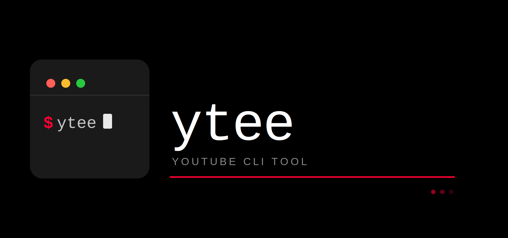

<p align="center">
  
</p>

# ytee

A minimal CLI for uploading videos to YouTube — single files or entire directories — powered by the YouTube Data API v3.

---

<div align="center">

## ⛔ PLEASE USE LATEST VERSION v0.1.5 ⛔

**Versions below v0.1.5 should not be used.**
Earlier versions have known bugs in upload history logging and missing error handling.

**Please upgrade:**
```bash
pip install --upgrade ytee
```

</div>

---

## Quickstart

```bash
ytee init → ytee set-creds → ytee upload
```

These three commands are all you need. **`init` must be run before anything else.**

---

## Installation

```bash
pip install ytee
```

Requires **Python 3.9+**.

---

## Setup

### 1. Get Google API credentials

Before using `ytee`, you need a Google Cloud project with the YouTube Data API v3 enabled:

1. Go to the [Google Cloud Console](https://console.cloud.google.com/).
2. Enable the **YouTube Data API v3**.
3. Create **OAuth 2.0 credentials** for a Desktop application.
4. Download the credentials as a JSON file (e.g. `client_secret.json`).

---

## CLI Commands

### `ytee init` — Run this first

Copies your Google OAuth credentials into `~/.ytee/.google_secrets/` so `ytee` can find them.

```bash
ytee init --secret-path /path/to/client_secret.json
```

| Option | Short | Description |
|---|---|---|
| `--secret-path` | `-s` | Path to your `client_secret.json` downloaded from Google Cloud Console |
| `--token-path` | `-t` | Path to an existing `token.json` (optional — skip if you don't have one yet) |

> ⚠️ This must be run at least once before any other command will work.

---

### `ytee migrate` — Migrate from v0.1.0

If you used `ytee` version `v0.1.0`, your credentials were stored under `~/.secrets/`. Newer versions store them in `~/.ytee/.google_secrets/`.

Run this once to move your existing credentials to the new location:

```bash
ytee migrate
```

Only needed if you previously ran `ytee init` on v0.1.0.

---

### `ytee set-creds` — Authenticate with Google

Opens a browser window for Google OAuth authorization and saves the access token to `~/.ytee/.google_secrets/token.json`.

```bash
ytee set-creds
```

Run this after `init`. If your credentials are still valid they are reused automatically — you don't need to re-run this every time. If your token has expired, `ytee` will automatically open the browser to re-authenticate.

---

### `ytee verify-creds` — Check credential status

Checks whether `client_secret.json` and `token.json` are present in `~/.ytee/.google_secrets/`.

```bash
ytee verify-creds
```

---

### `ytee upload` — Upload a video or directory

**Upload a single video:**

```bash
ytee upload --path video.mp4 --name "My Video Title" --desc "My description"
```

**Upload all videos in a directory:**

```bash
ytee upload --path ./videos --name "Episode - " --desc "My description"
```

When a directory path is given, `ytee` automatically detects it and uploads every file inside. Each filename (without extension) is appended to the `--name` prefix to form the video title. For example, if the directory contains `part1.mp4`, the title becomes `Episode - part1`.

| Option | Short | Description |
|---|---|---|
| `--path` | `-p` | Path to a video file or a directory of videos |
| `--name` / `--prefix` | `-n` | YouTube video title (used as a prefix for directory uploads) |
| `--desc` | `-d` | YouTube video description applied to all uploaded videos |
| `--privacy` | — | Privacy setting: `unlisted` (default), `public`, or `private` |

Supported formats: `.mp4`, `.mov`, `.avi`, `.wmv`, `.mkv`, `.webm`, `.m4v`, `.mpeg`, `.mpg`, `.flv`

After each successful upload, `ytee` saves a log entry to `~/.ytee/.uploads/uploaded.json`.

Uploads show a live progress table displaying upload speed, file size, time elapsed, and time remaining.

---

### `ytee show-uploads` — View upload history

```bash
ytee show-uploads
```

Prints the contents of `~/.ytee/.uploads/uploaded.json`, showing the file path, video title, and YouTube video ID of every past upload.

---

## Full Example Walkthrough

```bash
# Step 1 — point ytee to your Google credentials (once)
ytee init --secret-path ~/Downloads/client_secret.json

# Step 2 — authenticate with Google (once, or when token expires)
ytee set-creds

# Step 3 — check credentials are in place (optional)
ytee verify-creds

# Step 4a — upload a single video
ytee upload --path ~/videos/intro.mp4 --name "Introduction" --desc "Welcome to my channel"

# Step 4b — or upload a whole folder
ytee upload --path ~/videos --name "Lecture - " --desc "Course upload"

# Step 5 — view upload history
ytee show-uploads
```

---

## Error handling & retries

`ytee` handles common upload failures gracefully:

- **Token expired** — detected before and during upload, prompts you to run `ytee set-creds`
- **Quota exceeded** — YouTube's daily 10,000 unit limit (each upload costs ~1,600 units). `ytee` reports this clearly when hit. Quota resets at midnight Pacific Time.
- **Network errors** — timeouts, SSL errors, and connection drops are retried automatically with exponential backoff, up to 10 retries
- **Server errors** — YouTube 5xx errors are retried up to 5 times
- **Unsupported file types** — filtered out before upload with a clear message

---

## Notes

- Videos are uploaded as **unlisted** by default. Use `--privacy public` or `--privacy private` to change this.
- Credentials are stored in `~/.ytee/.google_secrets/` (`client_secret.json` and `token.json`).
- Upload history is stored in `~/.ytee/.uploads/uploaded.json`.
- Directory uploads process files sequentially with a short delay between each upload.

---

## Dependencies

| Package | Purpose |
|---|---|
| `google-api-python-client` | YouTube Data API v3 client |
| `google-auth-oauthlib` | OAuth 2.0 authentication flow |
| `rich` | Live progress table and terminal output |
| `typer` | CLI framework |